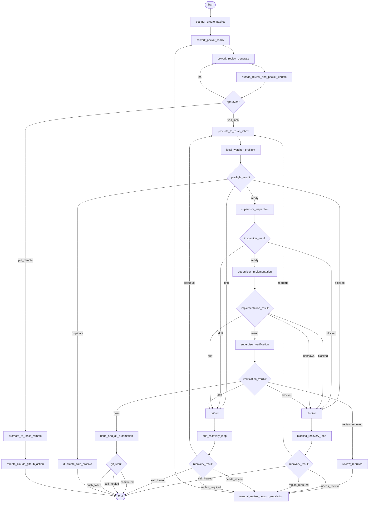
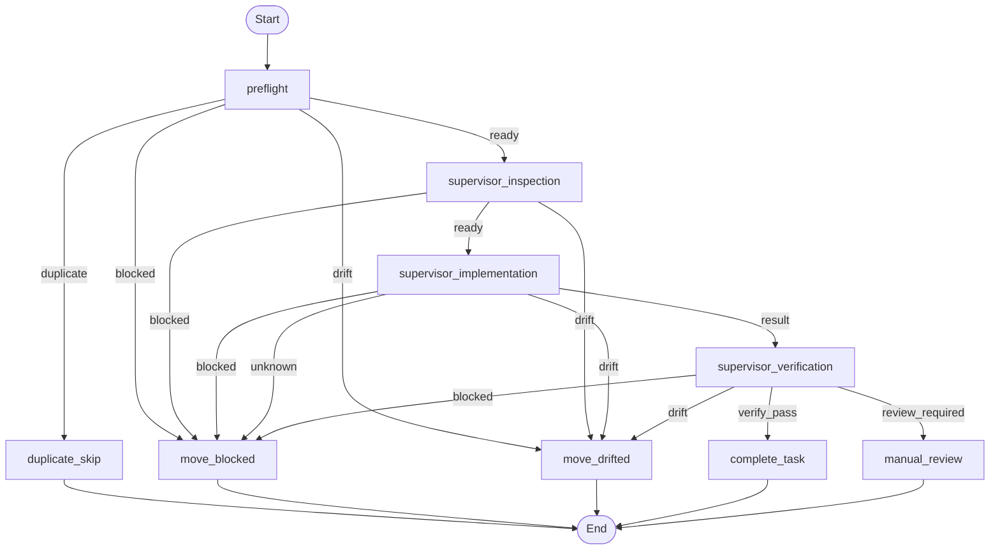
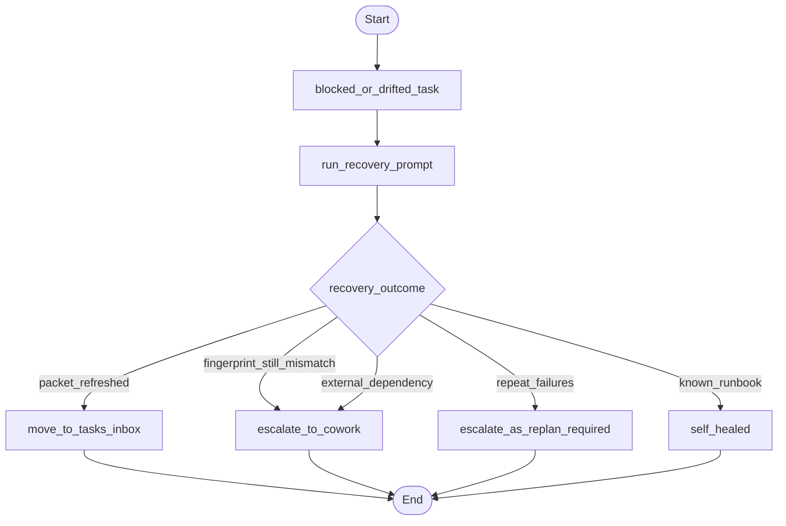

# Isoser Agentic Architecture as LangGraph

현재 구성된 에이전트 아키텍처를 LangGraph 관점으로 풀어 쓴 문서다.  
기존 [watcher-langgraph.md](./watcher-langgraph.md)는 `watcher.py` 내부 supervisor execution만 다루고, 이 문서는 `cowork_watcher.py`부터 approval, local execution, recovery, remote fallback까지 포함한 상위 구조를 설명한다.

## 핵심 아이디어
- 실제 런타임은 파일 큐와 watcher 루프 기반이다.
- 하지만 의사결정 구조는 LangGraph state machine처럼 보는 것이 가장 이해가 쉽다.
- 따라서 이 문서는 "운영 런타임은 watcher", "판단 구조는 LangGraph"라는 관점으로 읽으면 된다.

## Top-level graph



## Node meaning

### Planning / review layer
- `planner_create_packet`
  - 사람이 `cowork/packets/<task-id>.md`를 만든다.
- `cowork_review_generate`
  - `cowork_watcher.py`가 현재 저장소 기준 review 문서를 생성한다.
- `human_review_and_packet_update`
  - 사람이 review를 보고 packet 원본을 수정한다.
- `approved?`
  - Slack approval 또는 동등한 승인 경로.

### Promotion layer
- `promote_to_tasks_inbox`
  - 승인된 최신 packet 사본이 `tasks/inbox/`로 복사된다.
- `promote_to_tasks_remote`
  - 로컬이 아니라 remote fallback을 쓰는 packet은 `tasks/remote/`로 간다.

### Local execution layer
- `local_watcher_preflight`
  - deterministic check 구간.
  - duplicate packet, frontmatter, fingerprint mismatch, move failure 등을 먼저 본다.
- `supervisor_inspection`
  - packet과 현재 저장소의 정합성을 읽고 inspection handoff를 남긴다.
- `supervisor_implementation`
  - 구현과 result report를 만든다.
- `supervisor_verification`
  - 최종 검증 후 `pass` 또는 `review-required`를 낸다.

### Recovery / escalation layer
- `blocked_recovery_loop`
  - `tasks/blocked/`를 watcher가 다시 읽어 자동 복구 시도.
- `drift_recovery_loop`
  - `tasks/drifted/`를 watcher가 다시 읽어 자동 복구 시도.
- `manual_review_cowork_escalation`
  - 자동 복구가 안 되면 다시 `cowork/packets/`로 올려 사람 review와 approval 경로로 돌린다.

### Completion layer
- `done_and_git_automation`
  - 성공 task는 `tasks/done/`으로 이동하고 git automation을 시도한다.
- `git_result`
  - branch push 성공, main promotion skip, push failed, self-healed 등을 분기한다.

## Local watcher subgraph

`watcher.py` 안쪽만 좁히면 현재 configured graph는 아래처럼 볼 수 있다.



## Recovery subgraph

자동 복구 구간만 따로 보면 이렇게 설명할 수 있다.



## Self-healing node placement

현재 configured self-healing은 graph 전체에서 두 군데에 걸쳐 있다.

1. alert 처리 단계
- `write_alert()` 직전에 known fingerprint runbook을 적용한다.
- 예:
  - `origin/main` 자동 반영 스킵 -> `self-healed` info alert로 downgrade
  - 이미 `tasks/done/`이 있는 duplicate runtime-error -> archive 후 `self-healed`

2. 반복 이슈 remediation 단계
- known runbook으로 처리되지 않는 반복 이슈는 fingerprint를 쌓는다.
- 같은 root cause가 3회 이상 반복되면 `tasks/inbox/`에 auto-remediation packet을 생성한다.

즉:
- known issue -> immediate self-healing
- unknown repeated issue -> remediation task 생성

## Suggested LangGraph state schema

발표나 설계 논의에서는 아래 정도의 state로 설명하면 충분하다.

```python
from typing import Literal, TypedDict

FlowStage = Literal[
    "cowork_review",
    "approval",
    "local_preflight",
    "inspection",
    "implementation",
    "verification",
    "blocked_recovery",
    "drift_recovery",
    "manual_review",
    "completed",
    "remote",
]

Decision = Literal[
    "ready",
    "duplicate",
    "blocked",
    "drift",
    "result",
    "pass",
    "review_required",
    "requeue",
    "needs_review",
    "replan_required",
    "self_healed",
]


class AgenticFlowState(TypedDict, total=False):
    task_id: str
    stage: FlowStage
    decision: Decision
    packet_path: str
    report_path: str
    alert_fingerprint: str
    auto_recovery_attempts: int
    slack_thread_ts: str
```

## 발표용 해석 포인트
- 이 구조는 "AI 한 명이 끝까지 처리"가 아니라 "여러 agent 역할을 watcher가 orchestration"하는 구조다.
- `cowork_watcher.py`는 review/promotion orchestration이다.
- `watcher.py`는 execution/recovery orchestration이다.
- supervisor 3단계는 사실상 LangGraph 안의 subgraph다.
- 실패도 하나가 아니라 `drift`, `blocked`, `review-required`로 나뉜다.
- 운영 안정성은 recovery와 self-healing이 담당한다.

## 어떤 문서와 같이 보면 좋은가
- 전체 흐름 원본: [local-flow.md](./local-flow.md)
- 발표용 설명본: [agentic-flow-presentation.md](./agentic-flow-presentation.md)
- 로컬 watcher 내부 graph: [watcher-langgraph.md](./watcher-langgraph.md)
