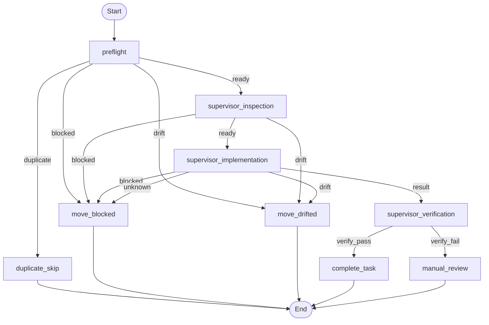
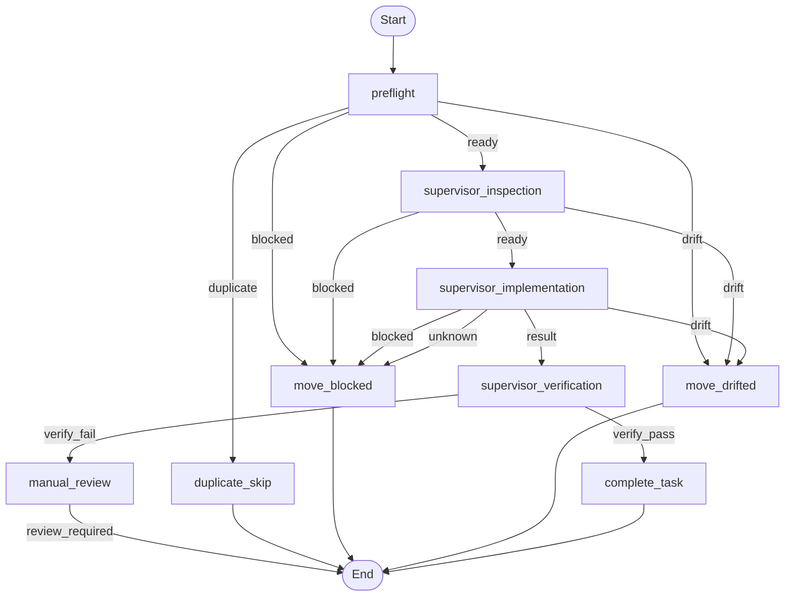

# Watcher LangGraph Review

`watcher.py`의 현재 supervisor 실행 흐름을 LangGraph 상태 그래프로 풀어 쓴 문서다.  
실제 graph 정의 코드는 `scripts/watcher_langgraph.py`에 있다.

## Current execution graph

현재 구현은 watcher preflight 이후 `inspector -> implementer -> verifier` 세 단계 supervisor 흐름으로 동작한다.

## Review

현재 구조의 장점:

- watcher preflight와 supervisor inspection이 분리되어 있어 packet metadata 오류와 구현 전 drift를 초기에 걸러낼 수 있다.
- inspection handoff(`reports/<task-id>-supervisor-inspection.md`)를 남겨 implementer가 맹목적으로 바로 수정하지 않게 했다.
- verifier artifact(`reports/<task-id>-supervisor-verification.md`)를 별도로 남겨 완료 조건이 더 명시적이 됐다.
- drift, blocked, done 상태 전이가 명시적이라 `tasks/*` 큐 운영과 잘 맞는다.

현재 구조의 한계:

- verifier가 `review-required` verdict를 남기면 watcher runtime도 이제 `needs-review` 공식 경로와 cowork escalation로 보낸다.
- manual review가 execution graph 안의 명시적 노드가 아니라 후처리/운영 규칙으로 흩어져 있다.
- 다만 파일 큐 관점에서는 여전히 `tasks/blocked/`에 잠시 적재되므로, 장기적으로는 verification 보류 전용 queue를 둘지 판단이 더 필요하다.
- recovery graph와 execution graph가 코드상으로는 분리되어 있지만 문서상 연결점이 약하다.

## Proposed graph

다음 개선은 `manual_review`를 공식 execution 노드로 올려 verification 실패를 blocked와 분리하는 것이다.

## Recommended improvements

1. verification 실패를 `manual_review` 공식 노드로 승격
- 지금은 verifier 실패가 blocked와 같은 종료 경로로 합쳐진다.
- `needs-review`와 `replan-required`를 graph route 값으로 직접 다루는 편이 운영상 더 명확하다.

2. verifier 산출물을 더 구조화
- 현재는 verification report가 markdown artifact다.
- 장기적으로는 `pass/fail`, `checks_run`, `residual_risks`를 machine-readable하게 함께 남기면 dispatch 분기에 재사용하기 쉽다.

3. recovery graph를 별도 LangGraph로 문서화
- `blocked/drifted -> recovery -> requeue/escalate` 경로를 execution graph와 같은 수준으로 보여주면 운영자가 전체 흐름을 더 쉽게 본다.

4. preflight와 inspection의 책임 경계를 더 명확하게 분리
- preflight: 파일 이동, frontmatter, fingerprint 같은 deterministic check
- inspection: 코드 영역 탐색, touched files 확정, 구현 outline 작성

## Practical conclusion

이 프로젝트에서는 watcher 전체를 LangGraph runtime으로 바꾸기보다:

- OS 루프, lock, 파일 이동, Slack/dispatch는 기존 watcher 유지
- supervisor decision flow만 LangGraph spec으로 관리

이 구성이 가장 안전하다.  
`scripts/watcher_langgraph.py`는 그 decision flow를 코드와 문서 양쪽에서 같은 형태로 다루기 위한 첫 단계다.
