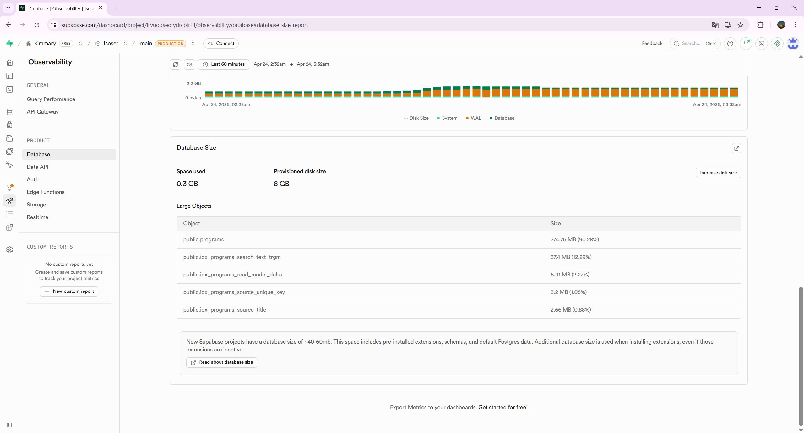

# Supabase Free Plan Program Migration Ops Guide v1

## 문서 목적

이 문서는 free plan Supabase에서 프로그램 정본 migration을 검증할 때, 어디까지는 해도 되고 어디서 멈춰야 하는지 운영 기준으로 정리한 가이드다.

비개발자도 이해하기 쉽게 단순 원칙부터 적는다.

## 가장 중요한 원칙

### 1. `programs`는 원본, `program_list_index`는 다시 만들 수 있는 캐시다

- `programs`
  - 원본 프로그램 데이터
  - 먼저 지우면 안 된다
- `program_list_index`
  - 목록 화면용 요약 캐시
  - 필요하면 비웠다가 다시 만들 수 있다
- `program_list_facet_snapshots`
  - 필터 옵션 캐시
  - 비워도 다시 만들 수 있다
- `program_detail_daily_stats`
  - 상세 조회 집계
  - 테스트 단계에서는 비워도 된다
- `program_source_records`
  - provenance 검증용 보조 테이블
  - free plan에서는 전체 적재를 오래 유지하기 어렵다

### 2. free plan에서는 “전체 적재”보다 “샘플 검증”이 우선이다

이번 세션에서 실제로 확인된 사실이다.

- 전체 `program_source_records` 적재는 논리적으로는 성공했지만, 용량을 빠르게 밀어 올렸다.
- 전체 `program_list_index` 재생성도 free plan에서 위험하다.

즉, free plan에서는 아래처럼 움직여야 한다.

- 구조 적용
- 샘플 50~100건 검증
- 결과 확인
- 전체 적재는 보류

### 3. `refresh_program_list_index(pool_limit)`는 free plan에서 바로 돌리지 않는다

이 함수는 이름만 보면 `pool_limit`만큼만 넣는 것처럼 보이지만, 실제 저장소 함수는 내부에서 delta refresh를 반복 호출해 사실상 전체 `programs`를 다시 채우는 구조다.

따라서 free plan에서는 아래를 먼저 쓴다.

- `refresh_program_list_delta(50)`
- `refresh_program_list_browse_pool(50)`

## 실제로 문제가 생겼을 때 판단 순서

### 경우 A. DB 용량 경고가 뜬다

먼저 큰 테이블부터 본다.

```sql
select
  n.nspname as schema_name,
  c.relname as table_name,
  pg_size_pretty(pg_total_relation_size(c.oid)) as total_size,
  pg_total_relation_size(c.oid) as total_bytes
from pg_class c
join pg_namespace n on n.oid = c.relnamespace
where c.relkind = 'r'
  and n.nspname in ('public', 'auth', 'storage')
order by total_bytes desc
limit 20;
```

이번 세션 기준으로는 아래가 핵심이었다.

- `public.programs`: 약 `275 MB`
- `public.program_list_index`: 약 `186 MB`

즉, 전체 삭제보다 `program_list_index` 계열부터 비우는 것이 우선이었다.

### 경우 B. `program_source_records`가 용량을 많이 먹는다

이 테이블은 `programs.primary_source_record_id`가 참조하고 있어서 바로 `truncate`가 안 될 수 있다.

안전한 순서는 아래다.

```sql
alter table public.programs
drop constraint if exists programs_primary_source_record_id_fkey;
```

```sql
update public.programs
set
  primary_source_record_id = null,
  primary_source_code = null,
  primary_source_label = null
where primary_source_record_id is not null
   or primary_source_code is not null
   or primary_source_label is not null;
```

```sql
truncate table public.program_source_records;
```

```sql
alter table public.programs
add constraint programs_primary_source_record_id_fkey
foreign key (primary_source_record_id)
references public.program_source_records(id)
on delete set null;
```

확인:

```sql
select
  (select count(*) from public.program_source_records) as source_record_count,
  (select count(*) from public.programs where primary_source_record_id is not null) as linked_program_count,
  (select count(*) from public.programs where primary_source_code is not null or primary_source_label is not null) as source_label_count;
```

기대값:

- `source_record_count = 0`
- `linked_program_count = 0`
- `source_label_count = 0`

### 경우 C. `program_list_index`를 비워 공간을 확보해야 한다

이 순서가 가장 안전하다.

```sql
truncate table public.program_detail_daily_stats;
```

```sql
truncate table public.program_list_facet_snapshots;
```

```sql
truncate table public.program_list_index;
```

확인:

```sql
select
  (select count(*) from public.programs) as programs_count,
  (select count(*) from public.program_list_index) as program_list_index_count,
  (select count(*) from public.program_list_facet_snapshots) as facet_snapshot_count,
  (select count(*) from public.program_detail_daily_stats) as detail_daily_stats_count;
```

기대값:

- `programs_count`는 그대로 유지
- 나머지 3개는 `0`

### 경우 D. `VACUUM` 실행 중 `cannot run inside a transaction block` 에러가 난다

이건 문법 오류가 아니라 실행 방식 문제다.

원칙:

- `VACUUM`은 다른 쿼리와 묶지 않는다
- SQL Editor에서 한 문장씩 따로 실행한다

예시:

```sql
vacuum full public.program_detail_daily_stats;
```

```sql
vacuum full public.program_list_facet_snapshots;
```

```sql
vacuum full public.program_list_index;
```

주의:

- `truncate + vacuum`를 한 번에 붙여 넣지 않는다
- `VACUUM FULL`은 테이블 잠금을 잡을 수 있다
- Usage 반영은 바로 안 보일 수 있고, 최대 1시간 정도 지연될 수 있다

## free plan에서 권장하는 검증 루트

### 1단계. 구조 적용

아래는 additive 구조 단계라 free plan에서도 우선 적용 가능하다.

- `create_program_source_records`
- `add_program_canonical_columns`
- `backfill_program_canonical_fields`
- `extend_program_list_index_surface_contract`

단, `backfill_program_source_records_from_programs`는 용량 여유를 확인한 뒤 제한적으로 본다.

### 2단계. 전체 적재 대신 샘플 적재

권장:

```sql
select public.refresh_program_list_delta(50);
```

```sql
select public.refresh_program_list_browse_pool(50);
```

또는 샘플을 조금 더 보고 싶으면 `100`까지는 상황을 보며 조절할 수 있다.

비권장:

```sql
select public.refresh_program_list_index(300);
```

이 함수는 free plan에서 사실상 전체 적재로 이어질 수 있다.

### 3단계. 샘플 검증

```sql
select count(*) as program_list_index_rows
from public.program_list_index;
```

```sql
select
  id,
  title,
  source_code,
  provider_name,
  application_end_date,
  recruiting_status,
  primary_link,
  detail_path,
  compare_path,
  cost_label
from public.program_list_index
order by indexed_at desc nulls last
limit 20;
```

샘플에서 봐야 하는 것:

- `source_code`가 채워졌는가
- `provider_name`이 비어 있지 않은가
- `primary_link`가 외부 원문 링크로 연결되는가
- `detail_path`가 `/programs/{id}` 형식인가
- `compare_path`가 `/compare?ids={id}` 형식인가
- `cost_label`이 사용자용 문구로 보이는가

### 4단계. 모집 상태는 KST 기준으로 확인

이번 세션에서 실제 DB는 UTC를 쓰고 있었다.

- `current_date = 2026-04-23`
- 한국 날짜는 `2026-04-24`

그래서 모집 상태는 DB 기본 날짜가 아니라 KST 기준 날짜로 봐야 했다.

확인 쿼리:

```sql
select
  current_date as db_current_date,
  timezone('Asia/Seoul', now())::date as kst_date,
  now(),
  current_setting('TimeZone');
```

현재 초안 기준 기대값:

- `application_end_date < kst_date` 이면 `closed`
- `application_end_date = kst_date` 또는 `kst_date + 7` 이내면 `closing_soon`
- 그 이후면 `open`

## 하지 말아야 할 것

### 1. `TRUNCATE ... CASCADE`

쉽게 보이지만, 참조 관계가 있는 원본 테이블까지 날릴 위험이 있다.

### 2. `programs`를 먼저 지우기

가장 큰 테이블이더라도 원본이므로 마지막까지 남겨야 한다.

### 3. `refresh_program_list_index(pool_limit)`를 free plan에서 바로 돌리기

이름과 달리 전체 적재로 이어질 수 있다.

### 4. `VACUUM`을 여러 SQL과 같이 실행하기

PostgreSQL 규칙상 실패한다.

### 5. DB 기본 timezone을 그대로 믿고 상태를 판정하기

이 프로젝트는 한국 사용자 대상이므로 KST 기준 비교가 안전하다.

## 추천 운영 시나리오

### 시나리오 A. free plan에서 설계 검증만 하고 싶다

이 순서를 추천한다.

1. 구조 migration 적용
2. `program_source_records` full backfill은 보류 또는 잠깐만 검증
3. `program_list_index`는 샘플 50~100건만 재적재
4. 링크/상태/라벨 확인
5. 문서화 후 종료

### 시나리오 B. 전체 적재까지 봐야 한다

아래 중 하나가 필요하다.

- 새 Supabase 프로젝트
- 유료 플랜

이 경우에만 아래를 안정적으로 보기 쉽다.

- `program_source_records` full backfill 유지
- `program_list_index` full refresh
- browse/search/archive 전체 검증

## 짧은 결론

free plan에서는 “전체 적재를 매번 끝까지 밀어붙이는 방식”이 아니라, “원본은 보존하고 캐시/보조 테이블을 비웠다가 샘플만 다시 채워 검증하는 방식”이 맞다.

이번 세션 기준으로는 아래가 최선의 운영 기준이다.

- `programs`는 남긴다
- `program_list_index`와 `program_source_records`는 필요 시 비운다
- `VACUUM FULL`은 단독 실행한다
- `refresh_program_list_index(...)` 대신 샘플용 `refresh_program_list_delta(...)`, `refresh_program_list_browse_pool(...)`를 쓴다
- 날짜 비교는 KST 기준으로 본다
