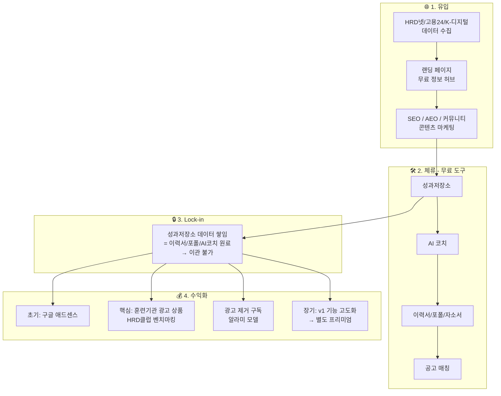
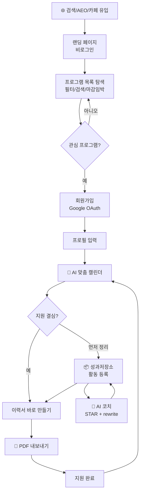
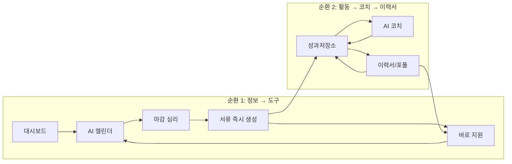
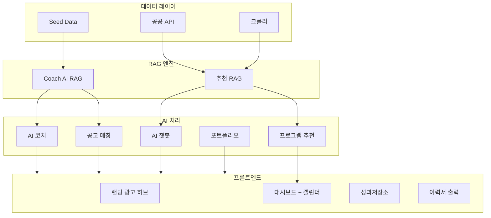

# 이소서 (Isoser) v2 — 통합 사업계획서

> "파편화된 취업 지원 프로그램 정보를 한곳에 모으고, 저장한 활동 데이터와 AI 코치로 지원 문서 작성을 이어주는 서비스." — PRD v2.3
> 

---

## 1. 서비스 개요

### 1-1. 서비스 한 줄 정의

<aside>
🎯

**이소서 = 국가 취업 지원 정보 허브 + AI 코치 기반 이력서 편집**
HRD클럽([hrdclub.co.kr](http://hrdclub.co.kr))이 하던 국비 교육 정보 + 훈련기관 광고 플랫폼을, 인프런([inflearn.com](http://inflearn.com)) 수준의 UI/UX로 재구축하고, AI 개인화 추천과 서류 즉시 생성 기능을 더한 서비스.

</aside>

### 1-2. 서비스 정체성

<aside>
⚡

**이소서는 이력서 편집기가 아닙니다.**
경쟁 상대는 AI 자소서 서비스가 아닙니다.
고용24, HRD넷, HRD클럽 같은 **정부/민간 취업 정보 사이트**입니다.

</aside>

### 1-3. 참고 모델

| **모델** | **참고 포인트** |
| --- | --- |
| **HRD클럽** ([hrdclub.co.kr](http://hrdclub.co.kr)) | 계좌제 교육 정보 + 훈련기관 광고 플랫폼 → **수익 구조 참고** |
| **인프런** ([inflearn.com](http://inflearn.com)) | 강좌 카드형 UI, 필터/검색, 깔끔한 대시보드 → **UX 목표 수준** |
| **더VC** | 벤처캐피탈 정보 대시보드 + 광고 수익화 → **BM 구조 참고** |

### 1-4. 핵심 가치 제안

| **기존 방식** | **이소서 v2** |
| --- | --- |
| 고용24, HRD넷 등 각 사이트 개별 검색 | AI가 내 프로필 기반으로 맞춤 추천 |
| 마감일 직접 추적 | 캘린더에 자동 노출, 마감 임박 하이라이트 |
| 지원 시 이력서/포폴 매번 새로 작성 | 성과저장소 데이터로 즉시 생성 |
| 정부 사이트의 낙후된 UX | 인프런 수준의 깔끔한 대시보드 |
| 훈련기관 광고가 정보와 분리됨 | 광고 자체가 정보 역할 → UX와 충돌 없음 |

### 1-5. v1 → v2 진화 스토리

| **구분** | **v1 (메인프로젝트 1)** | **v2 (메인프로젝트 2)** |
| --- | --- | --- |
| 핵심 | AI 코치 기반 이력서 편집·관리 | v1 + **국가 취업 지원 정보 허브** |
| BM | 구독(Free/Standard/Pro) — 수익 증거 없음 | **무료 + 광고 모델** → 추후 프리미엄 추가 |
| 차별점 | 활동 영구 보존 + AI 코치 + 직무별 조합 | v1 차별점 + **정보→도구 순환 플로우** |
| RAG | Coach AI — 직무 패턴 + STAR 예시 기반 코칭 | v1 RAG + **프로그램 추천 엔진** (프로필 × 프로그램 임베딩) |

<aside>
💡

**왜 피벗했나?** v1은 AI 코치 기반 이력서 편집 서비스였지만, **"굳이 여기 들어와서 돈을 내야 할 이유가 없다"**는 근본적 문제가 있었음. ChatGPT로도 문장 다듬기는 가능하니까. 정보 허브를 결합하면 (1) 무료 정보로 유저를 데려오고, (2) 성과저장소에 데이터가 쌓이면서 lock-in이 발생하고, (3) 광고로 수익화하는 구조가 됨 → 유료화 없이도 BM이 돌아감.

</aside>

### 1-6. 핵심 전략: 유입 → 체류(무료 도구) → Lock-in → 수익화

<aside>
🛠️

**1단계 — 유입**: 무료 취업 정보 허브로 유저를 데려온다 (더VC/HRD클럽 모델). 비로그인도 열람 가능.

**2단계 — 체류 (무료 도구)**: 정보만 모아주면 머무를 이유가 없음. 그래서 **v1에서 개발한 성과저장소·AI 코치·이력서·포트폴리오·자소서·공고매칭을 모두 무료로 제공**. 취준생이 이 도구들을 쓰면서 사이트에 머무는 이유가 생김.

**3단계 — Lock-in**: 성과저장소에 활동·성과 데이터가 쌓이면 떠나기 어려워진다. 이 데이터가 이력서·포폴·AI 코치의 원료이기 때문에, 쌓을수록 다른 서비스로 이관할 수 없음.

**4단계 — 수익화**: 훈련기관 광고 상품(핵심 BM) + 구글 애드센스(초기) + 광고 제거 구독(알라미 모델) + 장기적으로 v1 기능 고도화 → 별도 프리미엄.

</aside>

### 1-7. 2026-04-20 현재 구현 기준 정리

- 공개 유입 축은 `/landing-a`, `/programs`, `/compare`까지 구현되어 있다.
- 프로그램 허브는 `고용24`, `K-Startup`, 일부 HTML 수집 소스를 기반으로 운영 중이며, 사업계획서가 상정한 전체 공공지원 허브는 아직 확장 단계다.
- 추천 기능은 `POST /programs/recommend`, `GET /programs/recommend/calendar`로 연결돼 있다.
- 포트폴리오는 별도 생성 API가 아니라 `POST /activities/convert` 결과를 `/dashboard/portfolio` 미리보기로 이어주는 구조다.
- 게스트 모드는 제거되었고, 현재 워크스페이스 기능은 Google OAuth 로그인 사용자 기준으로 동작한다.

### v1 기능의 역할 진화

| **단계** | **v1 기능의 역할** | **목적** |
| --- | --- | --- |
| **지금** | 전체 무료 제공 | 유저가 머무를 이유 + 과제 요건 충족 |
| **유저 확보 후** | Lock-in 도구 | 성과저장소 데이터 쌓임 → 이탈 방지 |
| **장기** | 고도화 → 별도 유료 서비스 | AI 코치 프리미엄, 고급 포폴, 템플릿 등 추가 수익원 |

### BM Flow



### 유저 플로우



### 대시보드 레이아웃 와이어프레임

```
┌──────────────────────────────────────────────────────────────┐
│  👤 프로필 카드                  │  📊 광고 배너 슬롯            │
│  황지영 | 프론트엔드          │  Phase1: 애드센스              │
│  서울 | 경력 2년               │  Phase2: 훈련기관 스폰서        │
├──────────────────────────────────────────────────────────────┤
│  📅 AI 맞춤 취업 지원 캘린더                                     │
│ ┌──────────────────┐┌──────────────────┐┌──────────────────┐  │
│ │ 🔥 D-3          ││ 🟡 D-12         ││ 🟢 D-25         │  │
│ │ K-디지털 풀스택││ 청년 AI 인턴  ││ UX/UI 양성     │  │
│ │ HRD넷|서울     ││ 고용24|서울   ││ HRD넷|부산    │  │
│ │ 관련도 87%     ││ 관련도 72%     ││ 관련도 65%     │  │
│ │[지원][이력서]││[지원][이력서]││[지원][이력서]│  │
│ └──────────────────┘└──────────────────┘└──────────────────┘  │
├──────────────────────────────────────────────────────────────┤
│  📦 성과저장소(무료)        │  📝 최근 생성 서류             │
│  │ React 프로젝트  STAR✅│  │ 이력서_v3.pdf           │
│  │ 인턴 성과     STAR✅│  │ 포트폴리오_이소서.pdf │
│  │ 부트캠프 활동  AI↗ │  │ 자소서_코드잇.pdf     │
├──────────────────────────────────────────────────────────────┤
│  🤖 AI 코치(무료)            │  🎯 공고 매칭 분석(무료)       │
│  STAR 진단 + rewrite      │  4축 매칭 + 기업정보          │
└──────────────────────────────────────────────────────────────┘
```

---

## 2. 시장 분석

| **구분** | **수치** | **출처** |
| --- | --- | --- |
| 글로벌 이력서 최적화 시장 (2024) | 약 3,500만 달러 (470억 원) | 시장조사 |
| 글로벌 이력서 최적화 시장 (2033 예측) | 약 116억 달러로 성장 | 시장조사 |
| 국내 채용 플랫폼 MAU 1위 잡코리아 | 2,056만 명 | 잡코리아, 2025 |
| AI 자소서 활용 비율 (1년 반 만에) | 7% → 69% (9배) | 무하유, 2025 |
| Z세대 AI 자소서 활용 경험 | 91% | 캐치, 2025 |
| 국내 이직 준비 실업자 | 107만 9천 명 | 통계청, 2024 |
| 취준생 1인 평균 지원 기업 수 | 6.4개사 | 대학내일20대연구소, 2024 |

### 시장 기회 요약

- 국가 취업 지원 정보(HRD넷, 고용24, SBA 등)는 **파편화 + 낙후 UX** → AI 개인화 추천으로 통합하는 서비스는 아직 없음
- HRD클럽은 정보+광고 모델을 증명했지만 **개인화·서류 연계가 없음** → 이소서가 채울 갭
- 취준생 1인당 평균 6.4개사 지원, 이직 준비 실업자 107만 명 → **반복 서류 작성 수요 거대**
- 기존 AI 자소서 서비스(LLM 문장 다듬기)와 달리, 이소서는 **정보 제공이 서류 작성으로 연결되는 순환 구조** → ChatGPT와의 차별점이 명확

### 2-1. 왜 지금인가 (Why Now)

1. **AI 문서 작성은 이미 대중화됐다**: 사용자는 이제 AI 자체보다 "내 상황에 맞는 입력 데이터와 맥락"을 더 필요로 한다.
2. **공공 취업 정보는 여전히 분산돼 있다**: 고용24, K-Startup, 지자체 프로그램, 민간 교육 정보가 분절돼 있어 탐색 비용이 높다.
3. **취업 준비는 반복 지원 구조다**: 한 사람이 여러 공고와 프로그램을 병렬로 보며, 문서를 반복 수정하는 비용이 계속 발생한다.
4. **낡은 UX와 최신 기대치의 격차가 커졌다**: 사용자는 인프런·원티드 수준의 탐색 경험을 기대하지만 공공 정보 서비스는 그 기대를 충족하지 못한다.

### 2-2. 시장 진입 논리

- 지금 당장 필요한 것은 "완벽한 올인원 취업 플랫폼"이 아니라, **탐색 비용을 줄이고 문서 전환율을 높이는 좁은 문제 해결**이다.
- 이소서는 채용 공고 전체를 대체하려는 서비스가 아니라, **공공 지원 프로그램 탐색과 지원 문서 준비 사이의 끊어진 구간**을 먼저 메우는 전략이 적합하다.
- 따라서 초기 PMF는 "가장 정보 탐색 피로가 높고, 문서 재작성 빈도가 높은 세그먼트"에 집중해야 한다.

---

## 3. 문제 정의 (Pain Point)

### 3-1. 이력서 영역 (v1부터 해결)

1. 각 취업 포털마다 이력서 양식이 달라 **빈칸을 새로 채워야 한다**
2. 내용이 바뀔 때마다 포털마다 따로 업데이트 → **포털별 내용이 달라진다**
3. 프로젝트·대외활동·부트캠프 내역을 **한곳에서 정리할 공간이 없다**
4. 재직 중 성과를 기록하고 싶지만 별도 툴에서 따로 관리해서 **이력서 연결이 안 된다**

### 3-2. 취업 정보 영역 (v2에서 추가 해결)

1. 국비 교육·인턴 연계·청년 취업 사업 등 양질의 프로그램은 있지만 **어디에 있는지 찾기 어렵다**
2. 마감일·자격 요건을 **일일이 확인해야 하는 수고**
3. 지원하려면 이력서/포트폴리오를 **매번 새로 작성**해야 하는 비효율
4. 기존 정부 사이트(HRD넷, 고용24)의 **낙후된 UI/UX**

---

## 4. 타겟 사용자 & 페르소나

### 4-1. 타겟 우선순위

**1차 타겟: 직무전환자 / 공백기 취업자**

- 자소서·성과를 전면 재구성해야 하는 사람
- 정부 지원 프로그램 정보에 대한 수요가 높은 사람
- ChatGPT로는 **최신 공공 데이터 기반 개인화 추천이 불가능**한 영역

**2차 타겟:** 부트캠프 취준생 · 경력 1년차+ 이직자 · 경단녀 재취업

### 4-2. 공백기 정의

<aside>
📌

이소서 기준: **최근 6개월 이상 정규직 이력이 없는 상태**에서 취업 또는 직무 전환을 준비 중인 사람.
계좌제(국민내일배움카드) 수료 후 미취업자가 핵심 페르소나.

</aside>

### 4-3. 페르소나 3유형

| **구분** | **특징** | **핵심 니즈** | **v2 해결** |
| --- | --- | --- | --- |
| **A — 부트캠프 취준생** | 프로젝트 3~5개, 여러 직무 동시 지원 | 프로젝트별 정리 + 이력서·포폴에 녹이기 | 성과저장소 + AI 코치 + 포트폴리오 초안 생성 |
| **B — 직무전환 공백기** | 경력 공백, 정부 지원 프로그램 활용 희망 | 맞는 지원 사업 찾기 + 서류 즉시 준비 | AI 맞춤 캘린더 + 서류 즉시 생성 순환 |
| **C — 이직 재직자** | 경력 5~15년, 성과 기록 흩어져 있음 | 직무별 경력 조합 + 퀄리티 향상 | 활동 영구 보존 + 직무별 조합 출력 |

### 4-4. 초기 핵심 고객(ICP) 정의

**초기 ICP는 `직무전환 공백기 취업자`로 좁히는 것이 가장 유리하다.**

- 이유 1: 공공 지원 프로그램 탐색 니즈가 가장 강하다.
- 이유 2: 기존 경력과 새 목표 직무 사이의 서사 재구성이 필요해 문서 작성 도구 가치가 크다.
- 이유 3: ChatGPT 단독 사용으로는 최신 프로그램 정보와 개인 상황을 함께 연결하기 어렵다.
- 이유 4: 부트캠프 수료 후 미취업자, 내일배움카드 이용자 등 실제 커뮤니티 접근 경로가 뚜렷하다.

### 4-5. 핵심 Job To Be Done

> "나는 지금 내 상황에 맞는 지원 프로그램을 빠르게 찾고, 그 프로그램이나 공고에 맞는 서류를 다시 쓰는 시간을 줄이고 싶다."

세부 작업은 아래 3개로 나뉜다.

1. 어디를 지원해야 하는지 판단한다.
2. 지금 가진 경험 중 무엇을 꺼내 써야 하는지 정리한다.
3. 지원서류를 빠르게 조합해 제출 가능한 형태로 만든다.

---

## 5. 경쟁사 분석

| **서비스** | **이력서 관리** | **활동 기록** | **AI 코치** | **취업 정보** | **약점** |
| --- | --- | --- | --- | --- | --- |
| 커리어노트 | △ | ○ | △ 생성만 | 없음 | 이력서 관리 없음 |
| 사람인/잡코리아 | ○ 자사 한정 | ○ 자사 한정 | 없음~△ | 자사 공고만 | 포털 밖 사용 불가 |
| ChatGPT/Claude | △ 매번 새로 | 없음 | ○ | 없음 | 데이터 누적·최신 공공정보 없음 |
| HRD넷/고용24 | 없음 | 없음 | 없음 | ○ 각자 보유 | **UX 낙후, 파편화** |
| HRD클럽 | 없음 | 없음 | 없음 | ○ 광고 기반 | 개인화 없음, 도구 연계 없음 |
| **이소서 v2** | **○ 다양한 양식** | **○ 영구 저장·조합** | **○ 멀티턴 코치** | **○ AI 맞춤** | 초기 유저 확보 |

### 5-1. 실제 경쟁 대안

사용자의 실제 대안은 단일 서비스가 아니라 아래 조합에 가깝다.

- `고용24 / 지자체 사이트 / 커뮤니티 검색`으로 정보 탐색
- `노션 / 메모장 / 워드`로 활동 정리
- `ChatGPT / Claude`로 문장 다듬기
- `잡코리아 / 사람인 / 기업 양식`에 맞춰 다시 붙여넣기

즉, 이소서의 경쟁 대상은 특정 앱 하나가 아니라 **"파편화된 기존 행동의 묶음"** 이다.

### 5-2. 이소서의 방어력 후보

초기에는 UI나 LLM 호출만으로 방어력이 생기지 않는다. 장기 방어력은 아래 자산에서 나온다.

1. 사용자별 활동/성과 데이터 축적
2. 프로그램 메타데이터 정제 구조와 추천 피드백 로그
3. 어떤 프로그램에서 어떤 문서 생성 행동이 이어졌는지에 대한 전환 데이터
4. 비교 화면, 추천, 문서 작성에 공통으로 재사용되는 정규화된 프로그램 스키마

이 자산이 쌓일수록 단순 크롤링 사이트나 범용 LLM 대비 개인화 품질 격차를 만들 수 있다.

---

## 6. 서비스 구조 — 순환 플로우

```
[랜딩 페이지 — 광고 허브]
인기 부트캠프 TOP10, 훈련기관 광고, 국비 교육 정보 카드
(HRD클럽 콘텐츠 + 인프런 UX)
      ↓ 회원가입/로그인
[대시보드]
AI 맞춤 취업 지원 캘린더 + 광고 배너
      ↓
[관심 프로그램 클릭 → 마감 심리 작동]
      ↓
[이력서/포트폴리오 바로 만들기]
성과저장소 데이터 → 즉시 생성
      ↓
[지원 완료 → 다음 마감 일정 캘린더 노출]
      ↓ (반복)
```

### 순환 플로우 핵심 논리

1. **랜딩 페이지가 광고판**: 인기 부트캠프·훈련기관 카드 → 방문 즉시 광고 수익 발생
2. **마감 심리 작동**: 마감 임박 일정이 캘린더에 계속 노출 → "빨리 뭔가 해야 한다"
3. **서류 필요**: 지원하려면 이력서/포트폴리오 필요
4. **즉시 생성**: 성과저장소 데이터로 빠르게 만들어서 바로 지원
5. **다음 일정**: 지원 후 다음 마감 캘린더 노출 → 재방문 → 반복

### 이중 순환 구조



<aside>
💡

**두 순환의 연결 = Lock-in 논리**: 순환 1(정보 허브)로 유저를 데려오고, 순환 2(성과저장소·AI 코치·이력서)로 데이터가 쌓이면서 lock-in 발생. 성과저장소 데이터 = 이력서·포폴·AI 코치의 원료이므로, **쌓을수록 다른 서비스로 이관할 수 없음**.

</aside>

### 6-1. 핵심 퍼널 설계

초기 제품은 아래 퍼널을 가장 중요하게 본다.

1. `랜딩 방문`
2. `프로그램 목록 조회`
3. `프로그램 상세 조회`
4. `북마크 또는 비교`
5. `회원가입`
6. `활동 1건 이상 저장`
7. `문서 생성 또는 AI 코치 사용`
8. `7일 내 재방문`

### 6-2. 퍼널별 핵심 지표

| 구간 | 확인 지표 | 초기 목표 |
| --- | --- | --- |
| 유입 | 랜딩 방문 → 프로그램 상세 조회율 | 20%+ |
| 탐색 | 상세 조회 → 북마크/비교 전환율 | 10%+ |
| 가입 | 북마크/비교 → 회원가입 전환율 | 15%+ |
| 활성화 | 회원가입 → 활동 1건 저장 전환율 | 40%+ |
| 가치 경험 | 활동 저장 → 문서 생성 또는 AI 코치 사용률 | 50%+ |
| 잔존 | 7일 재방문율 | 25%+ |

### 6-3. North Star Metric 제안

초기 North Star는 **`문서 작성으로 이어진 프로그램 탐색 수`** 가 적합하다.

- 단순 PV보다 제품의 본질인 `정보 탐색 → 행동 전환`을 더 잘 보여준다.
- 광고형 허브와 문서 도구를 동시에 운영하는 이소서의 성격을 함께 반영한다.

---

## 7. 주요 기능

### 7-0. 🏠 랜딩 페이지 — 광고 허브 (신규, 메인프로젝트 2)

<aside>
🏠

기존 온보딩 페이지를 전면 재정의. AI 서비스 소개 페이지가 아닌, **국비 교육 정보 + 훈련기관 광고 허브**.

</aside>

- **비로그인 접근 가능** — 트래픽 유입 극대화
- 화면 구성:
    - 상단 풀배너: 훈련기관 광고 (HRD클럽 연계)
    - 인기 부트캠프 TOP 10 카드 (스폰서 슬롯 포함)
    - 카테고리별 국비 교육 과정 목록 (IT/디자인/경영/외국어)
    - 지역별 필터 (서울/경기/부산 등)
    - 마감 임박 과정 하이라이트
    - 사이드바: 자격증·채용 플랫폼 광고
    - 하단 CTA: "AI 맞춤 추천 받기" 회원가입 유도
- 광고 슬롯: 상단 풀배너 / 스폰서 카드 / 사이드바

### 7-1. 🗓️ AI 맞춤 추천/캘린더 (신규, 메인프로젝트 2)

- 사용자 프로필 기반 **개인화 추천** (`고용24`, `K-Startup`, 일부 HTML 수집 데이터)
- Sparse(직무명·지역) + Dense(의미 유사도) **하이브리드 검색** → 리랭킹
- 리랭킹: 관련도 점수(60%) + 마감 임박도(40%) 합산
- **마감일 기준 정렬** + 마감 임박 하이라이트
- 현재 구현 기준:
  - 공개 프로그램 탐색: `/programs`
  - 비교 페이지: `/compare`
  - 추천 API: `POST /programs/recommend`, `GET /programs/recommend/calendar`
  - 비교 적합도 API: `POST /programs/compare-relevance`
- 캘린더 카드 예시:

```
[마감 D-7] K-디지털 풀스택 개발자 과정
출처: HRD넷 | 지역: 서울 | 지원율: 100%
관련도: 87% | 마감: 2026.04.25
[지원하기]  [이력서 바로 만들기]
```

- 추가: 관심 프로그램 북마크는 구현, 지원 상태 트래킹은 후속 과제
- 추천 결과는 캐시와 추천 계산 로직이 연결돼 있으나 UX 퍼널은 계속 정리 중

### 7-2. 🤖 AI 코치 피드백 (v1 ⭐ 핵심 → v2 챗봇 확장)

<aside>
🤖

**LangGraph 멀티턴 + 제안형 rewrite** — AI가 최종본을 치환하지 않고, 유저가 선택·수정하는 초안을 제공.

</aside>

- STAR 분석 (Situation, Task, Action, Result 누락 진단)
- 직무별 **rewrite suggestion 1~3개** (text + focus + rationale)
- ChromaDB RAG: `job_keyword_patterns` + `star_examples` 컬렉션
- 멀티턴 연속 코칭 (세션 저장/복원)
- 코치 원칙: **없는 수치나 성과를 만들어내지 않음, 유저 원문만 구조화**
- **v2 확장**: 자연어 질문 기반 정보 검색 AI 챗봇
    - 예: "서울에서 AI 관련 국비 과정 있어?"
    - RAG 기반 정확한 답변 + 출처 링크 제공

### 7-3. 📦 성과저장소 (v1 데이터 허브)

- 내 이력·활동·성과 **영구 축적** (`is_visible` 토글로 이력서 포함 여부 관리)
- 직무 키워드·기술 태그 자동 추출
- AI 캘린더의 **개인화 엔진 입력**으로 활용

### 7-4. 📝 이력서·포트폴리오·자소서

- 활동·기술·자소서 선택 기반 **조합 생성 + PDF 내보내기**
- 회사별 요건에 맞춘 **맞춤 변환** ("한 번 정리 → 어디든 대응")
- **포트폴리오 미리보기** — 활동을 6섹션 구조(프로젝트 개요 / 문제 정의 / 기술적 의사결정 / 구현 / 성과 / 트러블슈팅)로 변환해 `/dashboard/portfolio`에서 확인
- 자기소개서 저장소 (목록/검색/편집/문항 저장)
- **v2 역할**: 캘린더 → 지원 서류 즉시 생성의 핵심 출구

### 7-5. 🎯 공고 매칭 분석 (v1)

- 공고 텍스트/이미지OCR/PDF 입력 → 4축 분석 → 매칭 점수 0~100
- 부족 키워드 → 활동 보강 유도 → AI 코치 연결

### 7-6. 🔗 지원 서류 즉시 생성 연결 (신규, 메인프로젝트 2)

- 캘린더에서 프로그램 선택 → 프로그램 요건 분석 → 관련 활동 자동 선택 → 이력서 초안 프리필
- 이력서 편집 페이지로 프리필 상태로 이동 → PDF 생성 → 지원

### 7-7. 🔍 정보 검색 AI 챗봇 (신규, 메인프로젝트 2)

- 자연어 질문으로 지원 사업 검색 + RAG 기반 답변 + 출처 링크
- 현재는 계획 단계이며 운영 라우트로는 아직 연결되지 않았다.

---

## 8. 수익 구조 (BM)

### 8-1. BM 변경 가설 & 페인포인트

<aside>
❓

**가설**: "취준생은 AI 이력서 편집 서비스에 돈을 내지 않는다. 하지만 취업 정보를 보기 위해 사이트에는 들어온다. 그리고 이력서 도구가 무료라면 그 사이트에 머무른다."

</aside>

**v1 BM의 페인포인트:**

- v1은 **구독/건당 결제** 모델 (Free / 1,000원 / 9,900원 / 29,900원)
- 문제: "굳이 여기 들어와서 돈 내야 할 이유가 없다" — ChatGPT로도 문장 다듬기 가능
- **유료화 근거가 약함** → BM이 돌아가지 않음

**v2 BM으로 전환한 논리:**

1. 유료화 대신 **무료 정보 허브로 유저를 데려오자** (더VC/HRD클럽 모델)
2. 정보만으로는 머무를 이유가 없으니 **v1 기능을 무료로 제공해서 체류시키자**
3. 성과저장소에 데이터가 쌓이면 **lock-in 발생** → 이탈 방지
4. 유저가 모이면 **훈련기관 광고 상품으로 수익화** (HRD클럽 벤치마킹)
5. 추가로 **광고 제거 구독**(알라미 모델) + 장기적으로 v1 기능 고도화 → 별도 프리미엄

**검증 포인트:**

| **가설** | **검증 방법** | **성공 기준** |
| --- | --- | --- |
| 취준생은 취업 정보를 보러 온다 | 랜딩 페이지 PV 추적 | 월 1,000 PV 이상 |
| 무료 도구가 있으면 머무른다 | 회원가입 전환율, 성과저장소 활동 등록 수 | 회원가입 5%+, 활동 3개+ 등록 |
| 데이터 쌓이면 떠나지 않는다 | 월간 재방문율 (MAU/DAU) | 월 재방문 30%+ |
| 광고가 UX와 충돌하지 않는다 | 광고 클릭률, 이탈률 비교 | 광고 페이지 이탈률 상승 없음 |

### 8-2. v2 수익 모델: 무료 정보 + 광고 상품

<aside>
🎯

**핵심 BM = HRD클럽의 광고 상품 구조를, 인프런 UI로 재구축**
훈련기관이 돈을 내고 교육 정보를 노출하는 광고 모델. 이 광고가 유저에게는 유용한 정보이기도 해서 UX와 충돌하지 않음.

</aside>

| **단계** | **수익원** | **설명** | **시점** |
| --- | --- | --- | --- |
| **Phase 1** | **구글 애드센스** (임시) | 초기 유저가 없을 때 자동 광고로 최소 수익 확보. 세팅만 하면 즉시 동작. | 런칭 즉시 |
| **Phase 2** | **훈련기관 광고 상품** (핵심) | HRD클럽 벤치마킹. 훈련기관이 돈을 내고 교육과정을 프리미엄 위치에 노출. 아래 광고 상품 테이블 참고. | 유저 확보 후 |
| **Phase 2.5** | **광고 제거 구독** | 월 2,900~4,900원. 광고 없는 깨끗한 화면 제공. (`is_premium` 플래그로 광고 슬롯 비노출) | 광고 누적 후 |
| **Phase 3** | **PDF 유료화 + 세미나 + B2B HR** | PDF 프리미엄 + 원데이 세미나(이력서 클리닉, 직무전환) + 훈련기관 연계 설명회 + 헤드헌터·기업 HR 대상 프로필 노출 | 장기 |

### 훈련기관 광고 상품 (Phase 2 — HRD클럽 벤치마킹)

<aside>
💰

HRD클럽 광고 상품(메인 중앙 대배너 30일 100만원, 좌우 대배너 30일 60만원, 프리미엄 기관배너 30일 30만원 등)을 참고하여, 이소서에 맞게 재설계.

</aside>

| **광고 상품** | **위치** | **설명** | **참고 단가** |
| --- | --- | --- | --- |
| **메인 배너** | 랜딩/대시보드 상단 | 풀와이드 배너 광고. 가장 노출도 높음. | 30일 ~100만원 |
| **프리미엄 교육정보 카드** | "인기 과정 TOP 10" 섹션 내 | 훈련기관 과정이 프리미엄 카드로 노출. **광고이지만 유저에게는 교육정보**. | 30일 ~30~60만원 |
| **사이드바 배너** | 프로그램 목록/상세 우측 | 자격증·채용플랫폼·훈련기관 배너 광고 | 30일 ~15~30만원 |
| **검색 상단 노출** | 프로그램 검색 결과 최상단 | 특정 키워드 검색 시 스폰서 과정 우선 노출 | 30일 ~20~40만원 |
| **뉴스/콘텐츠 영역** | 랜딩 하단 콘텐츠 섹션 | "국비뉴스 + 훈련기관 기사" 형식 네이티브 광고 | 30일 ~10~20만원 |

<aside>
💡

**핵심 논리**: 이 광고들은 유저에게 **교육 정보 그 자체**. HRD클럽에서도 훈련기관 광고가 동시에 유저가 찾는 교육과정 정보임. 이소서는 이 구조를 **인프런/원티드 수준 UI로 재구축**하여 광고 단가와 유저 경험을 동시에 높임.

</aside>

### 8-3. 유입 전략: 콘텐츠 + AEO + SEO

<aside>
🚀

**핵심**: 정보를 잘 가공해서 제공하는 것 자체가 마케팅. HRD클럽의 정보를 원티드/더VC 수준으로 예쁘게 가공해서 보여주는 UI가 경쟁력.

</aside>

- **AEO (AI Engine Optimization)**: ChatGPT/Perplexity가 이소서 콘텐츠를 소스로 인용하게 만듬기. `/programs/[id]` 페이지에 JSON-LD 구조화 데이터 삽입.
- **콘텐츠 마케팅**: "이달의 추천 국비교육 TOP 10", "직무전환자를 위한 지원사업 가이드" 등 시의성 있는 콘텐츠 주기적 발행
- **SEO**: 프로그램별 상세 페이지가 검색 엔진에 인덱싱되도록 메타태그 최적화
- **커뮤니티**: 국비교육 네이버 카페 등에 유용한 정보 공유 → 자연 유입

### 8-3-1. 초기 GTM 실행안

채널을 넓게 가져가기보다 초기 3개 채널에 집중하는 편이 효율적이다.

1. **검색형 콘텐츠**
   - 예: "서울 AI 국비지원 프로그램 정리", "직무전환자를 위한 K-Startup 지원사업 모음"
   - 목적: 프로그램 상세/목록 페이지 유입 확보
2. **커뮤니티 침투**
   - 부트캠프 수료생 커뮤니티, 국비교육 카페, 직무전환 오픈채팅
   - 목적: ICP가 실제로 머무는 곳에서 문제 공감 확보
3. **도구형 공유**
   - "지원 프로그램 비교표", "이력서 재조합 체크리스트", "공백기 스토리라인 가이드"
   - 목적: 문서 도구 가치까지 같이 인식시키기

### 8-3-2. 첫 100명 확보 전략

- 1단계: ICP 인터뷰 20명
- 2단계: 실제 프로그램 탐색/지원 준비 경험이 있는 사용자 30명에게 폐쇄형 테스트
- 3단계: 가장 반응이 좋은 콘텐츠 주제 3개를 반복 발행
- 4단계: "프로그램 찾기"보다 "지원 준비 시간 단축" 메시지로 전환 카피를 고정

### 8-3-3. 메시지 우선순위

초기 메시지는 아래 순서가 적합하다.

1. "내 상황에 맞는 지원 프로그램을 한 번에 찾는다"
2. "찾은 뒤 바로 지원 문서까지 연결된다"
3. "한 번 저장한 활동 데이터는 계속 재사용된다"

### 8-4. 비용 구조 & 손익분기점

| 항목 | 월 비용 | 비고 |
| --- | --- | --- |
| Vercel (프론트) | 0원 | 무료 티어 |
| Render (백엔드) | 0원 | 무료 티어 (15분 슬립) |
| Supabase (DB) | 0원 | 무료 티어 (500MB) |
| Gemini API | 0원 | 무료 티어 |
| 도메인 | ~1,500원 | 연 ~18,000원 |
| **합계** | **~1,500원/월** |  |
- 한국 취업 키워드 애드센스 RPM ≈ 3,000~8,000원/1,000PV
- **손익분기점: 하루 PV 20~30** → 거의 즉시 달성
- 유지비가 사실상 0이므로 **시간이 이소서 편** → 콘텐츠 쌓이고 SEO/AEO 효과 누적하면 됨

### 8-5. 광고 수익 핵심 논리

- 서비스 **전체 무료** → 진입 장벽 제거, 유저 규모 최대화
- **광고 = 정보**: 훈련기관 광고가 유저에게는 교육과정 정보 그 자체 → UX와 충돌 없음
- **Phase 1 애드센스**: 유저가 없는 초기에 자동 광고로 최소 수익 확보 (임시 수단)
- **Phase 2 훈련기관 광고 상품이 진짜 BM**: 트래픽 데이터(유저 수, PV, 체류 시간)로 광고 단가 협상 → HRD클럽 기준 월 수백만 원 규모 가능
- **Phase 2.5 광고 제거 구독**: 웹에서도 유투브 프리미엄처럼 광고 제거 구독 판매 가능 (나무위키, Reddit Premium 등 선례)
- HRD클럽 광고 네트워크 (1688-6499) 연계, 잡코리아·사람인 제휴 가능

### 8-5-1. BM 전환 조건

광고 BM은 "아이디어"가 아니라 **트래픽과 행동 데이터가 일정 수준 이상 쌓였을 때만 성립**한다.

| 단계 | 전환 조건 | 의미 |
| --- | --- | --- |
| 애드센스 실험 | 월 PV 5,000+ | 광고 슬롯 기본 반응 확인 |
| 직접 광고 영업 시작 | 월 UV 3,000+, 프로그램 상세 조회 데이터 축적 | 노출 가치 제안 가능 |
| 프리미엄 스폰서 상품 | 특정 카테고리/지역 페이지 반복 유입 확인 | 타겟 광고 단가 협상 가능 |
| 광고 제거 구독 실험 | 광고 슬롯 CTR과 이탈률 데이터 확보 | UX 훼손 없이 구독 제안 가능 |

### 8-5-2. BM 리스크

1. 초기 트래픽이 낮으면 광고 단가 협상이 불가능하다.
2. 광고가 정보로 보이지 않으면 UX 훼손이 생긴다.
3. 특정 수집 소스 의존도가 높으면 광고 상품도 함께 흔들릴 수 있다.
4. 문서 도구 사용자가 광고를 방해 요소로 느낄 가능성이 있다.

따라서 초기에는 광고 매출 극대화보다 **재방문과 문서 전환 유지**가 우선이다.

<aside>
📊

**벤치마킹**: HRD클럽 광고 상품 구조(메인 대배너 100만원/30일, 좌우 대배너 60만원/30일, 프리미엄 기관배너 30만원/30일). 이소서는 동일 구조를 **인프런/원티드 UI로 재구축**하여 광고 단가와 유저 경험을 동시에 상승시킴.

</aside>

### 8-6. 발표 시 BM 타당성 피칭 전략

발표 시점에 실제 수익 증거는 없으므로 다음 논리로 설명:

1. **v1 BM 한계 인정**: "유료화 근거가 약했다" → 피벗 이유 설명
2. **유사 모델 사례**: 더VC(정보+광고), HRD클럽(교육정보+훈련기관 광고)로 BM 검증
3. **수익 시뮬레이션**: 예상 DAU → 구글 애드센스 CPM 기반 월 매출 추정
4. **3단계 전략**: 무료 유입 → 데이터 lock-in → 광고 수익화 논리적 타당성
5. **구글 애드센스 → B2B 로드맵**: 초기는 자동화, 트래픽 확보 후 직접 영업으로 단가 상승

---

## 9. AI 기술 설계

### 9-1. RAG 파이프라인 아키텍처



### 9-2. Coach AI RAG (v1 핵심 → v2 고도화)

<aside>
🔑

**이소서 RAG는 일반 Q&A RAG와 다르다.** "사용자 원문 + 직무 패턴 + STAR 예시 → 코칭 피드백 + 리라이팅 제안" 구조.

</aside>

| 컬렉션 | 데이터 | 용도 |
| --- | --- | --- |
| `job_keyword_patterns` | 직무별 핵심 키워드 및 표현 패턴 | AI 코치가 직무 맞춤 표현 참고 |
| `star_examples` | STAR 기법 잘 적용된 이력서 문장 예시 | 좋은 문장 예시 참고 |

**v2 고도화:** Hybrid Search (BM25 + Vector) · Metadata Filter (`job_bucket`) · Few-shot 동적 삽입 · Reranker 검토

### 9-3. 프로그램 추천 RAG (v2 신규)

| **기술 요소** | **구현 방법** | **구현 위치** |
| --- | --- | --- |
| 임베딩 | Gemini Embedding API (`gemini-embedding-001`) — 프로필 + 프로그램 | `rag/embedder.py` |
| 벡터 DB | ChromaDB 에피머럴 (Render 512MB 대응) | `rag/` |
| 하이브리드 리트리버 | Sparse(직무명, 지역) + Dense(의미 유사도) | `routers/programs.py` |
| 리랭킹 | 관련도(60%) + 마감 임박도(40%) 합산 | `chains/` |
| LLM | Gemini 2.5 Flash (추천+챗봇) / 2.0 Flash (프론트 요약) | FastAPI / `app/api/summary` |
| 개인화 | 성과저장소 직무 키워드·기술 태그 → 프로필 임베딩 동적 업데이트 | `routers/programs.py` |

### 9-4. 기존 기술 자산 v2 역할 매핑

| **메인프로젝트 1 자산** | **v2에서의 역할** |
| --- | --- |
| 성과저장소 | 개인화 추천 엔진의 입력 데이터 |
| AI 코치 (RAG 기반) | 정보 검색 AI 챗봇으로 확장 |
| 이력서/포폴 생성 | 지원 서류 즉시 생성 부가 기능 |
| ChromaDB + LangChain | RAG 엔진 인프라 재활용 |

---

## 10. 기술 스택

| **영역** | **스택** | **비고** |
| --- | --- | --- |
| 프론트엔드 | Next.js 15 (App Router), React 19, TypeScript, Tailwind CSS | Vercel 배포 |
| 백엔드 API | FastAPI, LangChain, LangGraph, PyMuPDF | Render (Python 3.10.x) |
| DB / Auth | Supabase (PostgreSQL, GoTrue Auth, Storage) | PKCE + `@supabase/ssr` 쿠키 세션 |
| 벡터 DB | ChromaDB (에피머럴 모드) | Render 512MB 대응 |
| 임베딩 | Gemini Embedding API (`gemini-embedding-001`) | 로컬 모델 불가 → API |
| LLM | Gemini 2.5 Flash (백엔드) / 2.0 Flash (프론트) | 무료 API |
| 데이터 수집 | Python (공공 API + 크롤러) | `rag/collector/` |

---

## 11. 구현 현황 (2026-04-20 기준)

<aside>
✅

현재 저장소에서 확인 가능한 구현 범위를 기준으로 정리했다.

</aside>

- **인증/공개 진입**: Google OAuth + Supabase 세션, 공개 랜딩 `/landing-a`, 프로그램 탐색 `/programs`, 비교 `/compare`
- **온보딩**: 이력서 PDF → 프로필/활동 자동 추출 (`POST /parse/pdf`)
- **성과저장소**: 활동 CRUD + STAR + AI 요약
- **AI 코치**: 멀티턴 피드백 + 세션 저장/복원
- **공고 매칭**: 텍스트/OCR/PDF → 4축 분석 + 기업 정보 요약
- **이력서**: 조합 생성 + PDF 내보내기
- **포트폴리오**: 활동 변환 결과 기반 미리보기 `/dashboard/portfolio`
- **자기소개서**: 저장소 목록/검색/편집/문항
- **프로그램 허브**: 목록/상세/카운트/인기, 북마크, 추천, 캘린더 추천, 비교 적합도

---

## 12. 데이터 수집 범위

### 1순위 — 공공 API

| 출처 | 수집 대상 | 방식 |
| --- | --- | --- |
| **고용24** ([work.go.kr](http://work.go.kr)) | 취업 지원 프로그램, 훈련/정책 데이터 | 공공 API |
| **K-Startup** | 창업/지원 사업 데이터 | 공공 API |
| **추가 공공 소스 확장** | 부트캠프/지자체/지원사업 데이터 | 후속 확장 |

### 2순위 — 크롤링

| 출처 | 수집 대상 | 난이도 |
| --- | --- | --- |
| **SBA** 서울산업진흥원 | 청년 창업/취업 지원 | 보통 |
| **HRD클럽** ([hrdclub.co.kr](http://hrdclub.co.kr)) | 시장/광고 구조 벤치마크 | 낮음 |
| **각 지역 고용센터** | 지역별 취업 지원 행사 | 높음 |

<aside>
⚠️

고용24와 일부 외부 소스는 정책 변경에 따라 수집 방식이 흔들릴 수 있다. API 제공 범위와 HTML 파서 유지 비용을 함께 관리해야 한다.
**최소 기준**: 고용24 + K-Startup + 현재 HTML 수집 소스만으로도 공개 허브 MVP는 운영 가능.

</aside>

---

## 13. 데이터 모델 (Supabase)

### 기존 테이블 (메인프로젝트 1)

- `profiles`: name, bio, portfolio_url, email, phone, education, career, education_history, awards, certifications, languages, skills, self_intro, avatar_url
- `activities`: 활동 기본 필드 + STAR + 조직/기여/이미지 필드
- `resumes`: 이력서 버전, 타깃 직무, 선택 활동 ID 배열
- `coach_sessions`: 코치 대화/진단/제안 복원용 세션 데이터
- `match_analyses`: 매칭 점수, 키워드, 요약, 상세 payload
- `cover_letters`: 자기소개서 문항/답변 (qa_items 배열)
- `portfolios`: 스키마 존재, 메인프로젝트 2에서 본격 사용 예정

### 신규 테이블 (메인프로젝트 2)

- `programs`: 수집된 국가 취업 지원 프로그램
    - id, source, title, category, target(배열), skills(배열), region
    - start_date, end_date, deadline, duration_weeks, support_amount(%)
    - link, **is_ad**(광고 여부), **sponsor_name**, embedding_id
    - created_at, updated_at
- `recommendations`: 사용자별 추천 결과 캐싱 및 보조 점수 저장 (24시간 유효)
    - id, user_id, program_id, similarity_score, urgency_score, final_score, generated_at
- `program_bookmarks`: 관심 프로그램 북마크
    - id, user_id, program_id, created_at

### 스토리지

- `activity-images` 버킷 (기존)

---

## 14. API 엔드포인트

### 기존 API (메인프로젝트 1)

| Method | Path | 설명 |
| --- | --- | --- |
| POST | `/parse/pdf` | 이력서 PDF 구조화 |
| POST | `/coach/feedback` | AI 코치 멀티턴 |
| GET | `/coach/sessions` · `/{id}` | 세션 저장/복원 |
| POST | `/match/analyze` · `/match/rewrite` | 공고 매칭 및 리라이팅 |
| POST | `/match/extract-job-image` · `/extract-job-pdf` | 공고 OCR/PDF 추출 |
| POST | `/company/insight` | 기업 정보 요약 |

### 신규 API (메인프로젝트 2)

| Method | Path | 설명 | 구현 파일 |
| --- | --- | --- | --- |
| GET | `/programs` · `/{id}` | 프로그램 목록/상세 | `routers/programs.py` |
| GET | `/programs/popular` | 인기 프로그램 TOP N (랜딩용) | `routers/programs.py` |
| GET | `/programs/count` | 조건별 프로그램 수 조회 | `routers/programs.py` |
| POST | `/admin/sync/programs` | 데이터 동기화 (관리자) | `routers/admin.py` |
| POST | `/programs/recommend` | 맞춤 추천 (RAG) | `routers/programs.py` |
| GET | `/programs/recommend/calendar` | 캘린더용 추천 | `routers/programs.py` |
| POST | `/programs/compare-relevance` | 비교 화면용 AI 적합도 계산 | `routers/programs.py` |
| POST | `/activities/convert` | 활동 STAR/포트폴리오 구조 변환 | `routers/activities.py` |
| GET/POST/DELETE | `/bookmarks` | 북마크 목록/저장/삭제 | `routers/bookmarks.py` |

### 프론트 내부 API

- `POST /api/summary`: 보조 요약/어시스턴트 응답

---

## 15. 주요 화면 구성

### 랜딩 페이지 (전면 개편)

```
[상단 풀배너] 훈련기관 광고
[인기 부트캠프 TOP 10] 카드형 (스폰서 슬롯 포함)
[카테고리 필터] IT / 디자인 / 경영 / 외국어 / ...
[지역 필터] 서울 / 경기 / 부산 / ...
[마감 임박 과정] D-7 하이라이트 섹션
[사이드바] 자격증 / 채용 플랫폼 광고
[하단 CTA] "AI 맞춤 추천 받기" 회원가입 유도
```

### 대시보드 (개선)

```
[상단] 프로필 카드 + 광고 배너
[메인] AI 맞춤 취업 지원 캘린더 (이달의 추천 일정)
[보조] 성과저장소 요약 카드
[하단] 최근 생성 서류 목록
```

### 신규 화면 (메인프로젝트 2)

- `/landing-a`: 공개 메인 랜딩
- `/programs`: 국가 취업 지원 프로그램 전체 목록
- `/programs/[id]`: 프로그램 상세 + 이력서 즉시 생성 버튼
- `/compare`: 공개 프로그램 비교
- `/dashboard/portfolio`: 활동 변환 결과 미리보기
- `/chat`: 정보 검색 AI 챗봇 구상 단계

---

## 16. 비기능 요구사항

- **RLS**: 사용자 본인 데이터만 조회/수정 가능
- **비로그인 접근**: 랜딩 페이지 + 프로그램 목록은 비로그인으로 열람 가능 (개인화 없음)
- **캐싱**: 추천 결과 24시간 캐싱, 프로그램 데이터 주기 동기화
- **에러 복원력**: 외부 API 수집 실패 시 기존 DB 데이터 유지
- **성능**: 랜딩 페이지 첫 로딩 2초 이내, 캘린더 카드 3초 이내 노출
- **운영**: Frontend(Vercel), Backend(Render), DB(Supabase), VectorDB(ChromaDB 에피머럴)

---

## 17. Supabase 아키텍처 결정

| 결정 | 이유 |
| --- | --- |
| ChromaDB 에피머럴 | Render 512MB OOM 방지 |
| Gemini Embedding API | 로컬 모델 불가 |
| PKCE + `@supabase/ssr` 쿠키 | 로그인 루프 방지 |
| `supabase/migrations` 파일 관리 | SQL Editor 직접 수정 금지 |
| `CLAUDE.md` 프로젝트 루트 | Claude Code / Codex 컨텍스트 보존 |

---

## 18. 마이그레이션 운영

### 현재 반영된 마이그레이션

- `001_init_schema.sql`
- `002_add_bio_to_profiles.sql`
- `003_create_cover_letters.sql`
- `004_add_qa_items_to_cover_letters.sql`
- `20260408113000_add_portfolio_url_to_profiles.sql`
- `20260410120000_create_programs_and_bookmarks.sql`
- `20260415113000_add_compare_meta_to_programs.sql`

### 메인프로젝트 2 후속 예정

- 추천 고도화 관련 보조 스키마 확장
- 광고/스폰서드 슬롯 운영용 스키마 확장

### 규칙

- 기존 마이그레이션 파일 수정 금지
- 변경사항은 새 SQL 파일로 추가

---

## 19. 개발 로드맵 (현재 기준 재정리)

| 상태 | 마일스톤 | 주요 작업 | 산출물 |
| --- | --- | --- | --- |
| **완료** | 공개 허브 MVP | `/landing-a`, `/programs`, `/compare`, 프로그램 목록/상세/북마크 | `frontend/app/(landing)`, `backend/routers/programs.py`, `backend/routers/bookmarks.py` |
| **완료** | 추천/비교 기반 API | `/programs/recommend`, `/programs/recommend/calendar`, `/programs/compare-relevance` | `backend/routers/programs.py` |
| **완료** | 문서 작성 워크스페이스 | 활동 저장소, AI 코치, 이력서, 자기소개서, 포트폴리오 미리보기 | `frontend/app/dashboard/*`, `backend/routers/*` |
| **다음 단계** | 데이터 소스 확장 | 소스 다양화, 수집 품질 안정화, 메타데이터 보강 | `backend/rag/collector/` |
| **다음 단계** | BM/검색 확장 | 광고 상품 운영, 스폰서드 슬롯, 자연어 검색 챗봇 | 후속 설계 |

---

## 20. 리스크 및 대응

### 20-1. 데이터 수집 현실성

- **리스크**: 사이트별 구조 다름, 크롤링 차단
- **대응**: 공공 API 우선. 현재는 고용24 + K-Startup + HTML 수집 소스를 최소 운영 단위로 관리

### 20-2. 광고 수익 타이밍

- **리스크**: 발표 시점 실제 수익 증거 없음
- **대응**: 더VC + HRD클럽 사례 + 시장 데이터 + 광고 단가 시뮬레이션

### 20-3. 기존 기능 위치 (v1→v2)

- **리스크**: 성과저장소·AI코치가 부가로 밀림
- **대응**: 순환 플로우에서 서류 생성이 **필수 단계**. "정보 허브 + 도구"가 하나의 시스템
- **확인 필요**: 강사 상담 시 기존 기능 부가 기능화 방향 직접 확인

### 20-4. RAG 고도화 인정

- **리스크**: 단순 크롤링+필터링으로 보일 수 있음
- **대응**: (1) Coach AI Hybrid Search 고도화 + (2) 프로필×프로그램 벡터 유사도 + 리랭킹을 **기술 설계 전면 배치**

### 20-5. Render 제약

- **리스크**: 512MB, ChromaDB 영속 불가
- **대응**: 에피머럴 + `seed.py` 재적재. Gemini Embedding API로 로컬 모델 의존 제거

### 20-6. 제품 검증 리스크

- **리스크**: 사용자가 정보 탐색만 하고 문서 도구로 넘어오지 않을 수 있다.
- **대응**: 프로그램 상세에서 비교, 북마크, 문서 생성 CTA를 분리 측정해 전환이 가장 높은 흐름을 우선 강화한다.

### 20-7. 메시지 포지셔닝 리스크

- **리스크**: "AI 취업 도구"로만 보이면 ChatGPT 대체재로 오해받고, "정보 사이트"로만 보이면 문서 도구 가치가 묻힌다.
- **대응**: 초기 포지셔닝은 `지원 프로그램 탐색 + 지원 준비 도구`로 고정하고, 카피와 랜딩 메시지를 일관되게 운영한다.

---

## 21. 검증 로드맵

### 21-1. 0단계: 문제 검증

- 대상: 직무전환 공백기 취업자 20명
- 질문:
  - 실제로 어떤 사이트를 몇 군데 돌며 정보를 찾는지
  - 지원 문서를 다시 쓰는 데 가장 오래 걸리는 구간이 어디인지
  - 공공 지원 프로그램 정보를 놓친 경험이 있는지
- 목표:
  - 정보 탐색 문제와 문서 재작성 문제가 함께 나타나는지 확인
  - ICP 정의가 과도하게 넓지 않은지 확인

### 21-2. 1단계: 행동 검증

- 목표 행동:
  - 프로그램 상세 조회
  - 북마크 또는 비교
  - 회원가입
  - 활동 저장
  - 문서 생성 또는 AI 코치 사용
- 판단 기준:
  - 북마크/비교 없이 바로 이탈하면 정보 허브 가치가 약한 것
  - 활동 저장 없이 이탈하면 문서 도구 진입 장벽이 높은 것
  - 문서 생성 없이 이탈하면 탐색과 작성 연결 UX가 약한 것

### 21-3. 2단계: 잔존 검증

- 7일 재방문율
- 14일 내 두 번째 문서 생성 비율
- 북마크한 프로그램 재조회 비율
- AI 코치 재사용 비율

### 21-4. 피벗/중단 기준

아래 조건이 지속되면 방향 수정이 필요하다.

1. 프로그램 상세 조회는 높지만 회원가입 전환이 낮다.
2. 회원가입은 되지만 활동 저장률이 낮다.
3. 활동 저장은 되지만 문서 생성 전환이 낮다.
4. 문서 생성은 되지만 재방문이 거의 없다.

이 경우 각각 `정보 탐색 가치`, `온보딩 UX`, `문서 CTA 설계`, `잔존 동기` 중 어디가 약한지 분리해 수정해야 한다.

---

## 22. 발표 스토리라인

1. **문제 정의**: 취준생의 2가지 고통 — 이력서 반복 작성 + 정보 파편화 (실제 스크린샷: 고용24, HRD넷의 복잡한 UI)
2. **솔루션**: 이소서 v2 — AI가 맞춤 추천하는 취업 정보 허브
3. **순환 플로우 시연**: 랜딩 → 캘린더 → 서류 생성 → 지원 라이브 데모
4. **기술 고도화**: 2가지 RAG (Coach AI + 프로그램 추천) — 벡터 유사도, 하이브리드 검색, 리랭킹
5. **BM**: 광고 모델 + 더VC/HRD클럽 참고 사례 + 시장 규모
6. **포트폴리오**: 목적 → 문제 → 기술 → 결과까지 하나의 스토리라인

---

## 23. 즉시 액션 항목

- [ ]  **강사 상담**: BM 방향 + 기존 기능 위치 확인 (필수)
- [ ]  **공공 API 키 신청**: HRD넷, 고용24, K-디지털 ([data.go.kr](http://data.go.kr), 발급 1~2일)
- [ ]  **데이터 수집 파이프라인 설계**: API 클라이언트 + 크롤러 아키텍처 확정
- [ ]  **RAG 파이프라인 설계**: 프로필 임베딩 스키마 + 프로그램 임베딩 스키마 정의
- [ ]  **Figma 목업**: 랜딩 페이지 광고 허브 + 대시보드 캘린더 뷰 와이어프레임
- [ ]  **HR 피드백**: 서비스 컨셉 유효성 검토

---

## 변경 이력

- **v2.2** (2026-04-20): 현재 구현 상태 기준으로 공개 랜딩/프로그램 허브/비교/추천 API, 포트폴리오 미리보기, 게스트 모드 제거, 실제 수집 소스와 라우트 경로를 정정.
- **v2.1** (2026-04-10): PRD v2.1 전면 반영. 서비스 정체성·참고 모델·핵심 가치 제안 추가, F0 랜딩 광고 허브 상세, 화면 구성·비기능 요구사항·마이그레이션·즉시 액션 항목 신규 섹션, bookmarks 테이블 추가.
- **v2.0** (2026-04-10): 노션 페이지(PRD v1.0, 유저플로우, 와이어프레임, Coach AI 로드맵) + 회의록 + README 기반 통합 사업계획서 초안.
