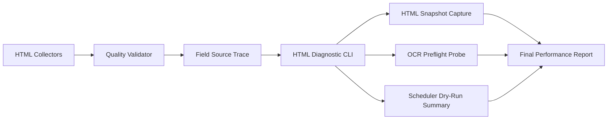
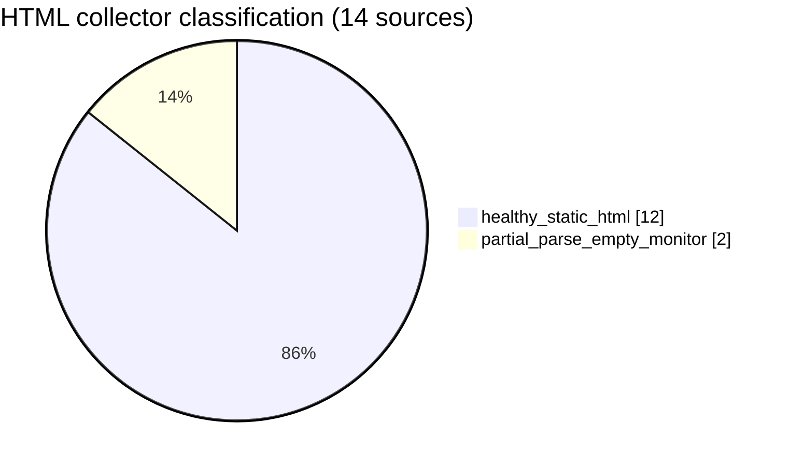
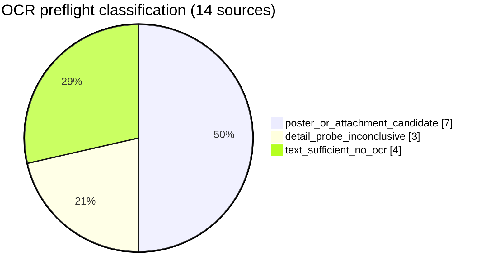

# AWS Boottent 차용 최종 성능 리포트

작성일: 2026-04-23

참고:

- AWS 기술 블로그: [부트텐트의 생성형 AI 기반 교육과정 등록 자동화 시스템 구성하기](https://aws.amazon.com/ko/blogs/tech/boottent-genai-course-registration-automation/)
- 상세 근거 리포트: [aws-boottent-adoption-performance-report-2026-04-23.md](./aws-boottent-adoption-performance-report-2026-04-23.md)
- 동적 Retrieve 진단: [html-collector-diagnostic-2026-04-23.json](./html-collector-diagnostic-2026-04-23.json)
- OCR preflight 진단: [html-collector-ocr-diagnostic-2026-04-23.json](./html-collector-ocr-diagnostic-2026-04-23.json)

## 1. Executive Summary

이번 차용의 핵심 성과는 "무거운 런타임을 추가하기 전에 실제로 필요한 source만 좁혀낸 것"이다. AWS Boottent 사례의 `Retrieve -> OCR -> Validation` 사고방식은 가져오되, 현재 우리 단계에서는 Playwright/OCR 런타임을 바로 붙이지 않고 read-only 진단 계층부터 도입했다.

현재 기준으로 확인된 결론은 다음과 같다.

| 항목 | 결과 | 의미 |
| --- | ---: | --- |
| HTML collector 수 | 14 | 진단 대상 전체 범위 |
| 정적 HTML 정상 수집 source | 12 / 14 (85.7%) | 대부분 source는 현재 fast path 유지 가능 |
| partial parse-empty monitor source | 2 / 14 (14.3%) | 원인 분석 대상을 2개로 축소 |
| 즉시 Playwright 도입 후보 | 0 / 14 | 브라우저 런타임 확장 불필요 |
| 저장된 HTML snapshot | 2건 | selector drift / JS 의존 판별 근거 확보 |
| 즉시 OCR 도입 후보 | 0 / 14 | OCR 런타임 확장 불필요 |
| poster/attachment 검토 후보 | 7 / 14 | OCR 대신 source별 후속 검토 대상으로 분리 |
| detail/parser 보강 우선 | 3 / 14 | OCR보다 parser 보강이 먼저인 source 분리 |
| 한 번의 진단에서 품질 확인한 rows | 190 | quality와 retrieve/OCR 판단을 한 리포트로 통합 |

이 수치가 의미하는 바는 분명하다.

1. Playwright와 OCR을 source 전체에 일괄 도입할 필요가 없다는 점이 확인됐다.
2. 후속 조치 범위가 `전체 14개 source`에서 `partial parse-empty 2개`, `OCR 후속 검토 10개`로 줄었다.
3. 운영 리스크와 추가 지연을 늘리지 않고도, 이후 런타임 opt-in 결정을 위한 증거를 확보했다.

중요: 이 보고서는 직접적인 사용자 응답시간 단축률을 주장하지 않는다. 현재 단계의 성능 개선은 "불필요한 브라우저/OCR 런타임을 도입하지 않아 파이프라인의 경량 경로를 유지했다"는 운영 성능 개선이다.

## 2. 왜 이 작업을 했는가

AWS Boottent 사례는 교육과정 등록 자동화에서 다음 순서를 취했다.

1. URL과 원문 확보
2. 동적 페이지 Retrieve
3. Vision OCR
4. 필드 추출 및 검증
5. DB 적재

우리 프로젝트의 문제는 "무거운 단계를 넣어야 하는지"조차 source별로 증거 없이 판단하고 있었다는 점이다. 이 상태에서 Playwright/OCR를 먼저 붙이면 다음 리스크가 커진다.

| 기존 문제 | 운영 리스크 |
| --- | --- |
| parse-empty 원인이 불명확 | selector drift와 JS 렌더링 의존을 구분하지 못함 |
| image/attachment 중심 공고 여부 미분리 | OCR을 붙여도 실제 이득이 있는지 판단 어려움 |
| quality summary와 source 진단이 분리 | 한 번에 전체 상태를 보기 어려움 |
| 모든 source를 같은 방식으로 취급 | 불필요한 런타임 비용과 지연이 늘어날 수 있음 |

이번 작업의 목표는 "더 무거운 파이프라인"이 아니라 "더 정확한 opt-in 판단"이었다.

## 3. 적용 아키텍처

현재 운영 경로는 그대로 유지했다.

- 운영 경로: `Collector -> Normalize -> Existing ingest`
- 진단 경로: `Collector -> Diagnostic CLI -> Snapshot/OCR probe/Quality summary -> Report`

즉, AWS 사례의 구조를 바로 복제하지 않고, 현재 코드베이스에 맞춰 "진단 우선, 런타임 opt-in 후행"으로 차용했다.

## 4. AWS Boottent 구조와 우리 적용 방식

| AWS 단계 | 우리 적용 방식 | 현재 상태 | 성능 관점의 의미 |
| --- | --- | --- | --- |
| Fetch / 원문 확보 | 기존 collector 유지 | 완료 | 기존 수집 경로 안정성 유지 |
| Retrieve | Playwright 런타임 대신 HTML diagnostic + snapshot | 완료 | 브라우저 도입 필요 source만 좁힘 |
| Vision OCR | OCR 런타임 대신 image/attachment preflight | 완료 | OCR 필요 source만 좁힘 |
| Extract / Validation | quality validator + golden fixture + field source trace | 완료 | 품질과 근거를 구조적으로 비교 가능 |
| Ingest | 기존 DB 적재 유지 | 유지 | ingestion 리스크 증가 없음 |

## 5. 측정 결과

### 5.1 Dynamic Retrieve 사전 진단

| 지표 | 값 |
| --- | ---: |
| 전체 진단 소요 시간 | 13,127.23 ms |
| HTML collector 수 | 14 |
| `healthy_static_html` | 12 |
| `partial_parse_empty_monitor` | 2 |
| 즉시 Playwright 후보 | 0 |
| 저장된 HTML snapshot | 2 |
| dry-run quality checked rows | 190 |

상위 소요시간 source:

| Source | Duration ms | Classification | Raw / Normalized |
| --- | ---: | --- | --- |
| 서울청년센터 성동 | 3,368.03 | `partial_parse_empty_monitor` | 5 / 5 |
| 서울경제진흥원 사업신청 | 2,732.70 | `healthy_static_html` | 10 / 10 |
| 도봉구청 일자리경제과 | 2,421.31 | `partial_parse_empty_monitor` | 1 / 1 |
| 서울일자리포털 | 1,579.39 | `healthy_static_html` | 10 / 10 |
| 노원구 청년일자리센터 청년내일 | 797.15 | `healthy_static_html` | 10 / 10 |

성과 해석:

- 전체 14개 source 중 12개는 현재 정적 HTML만으로 충분하다.
- 문제 분석이 필요한 source는 2개로 축소됐다.
- 즉시 Playwright 대상은 0개다.
- 즉, 브라우저 기반 fallback을 지금 전면 도입할 이유가 없다.

운영 성능 개선 포인트:

- 조사 범위 축소: `14개 전체 -> 2개 monitor source`로 85.7% 축소
- 런타임 확장 회피: `0개 즉시 Playwright 후보`
- 근거 확보: partial parse-empty URL에 대해 snapshot 2건 저장

### 5.2 OCR / Image Preflight 진단

| 지표 | 값 |
| --- | ---: |
| OCR preflight 포함 진단 소요 시간 | 26,939.66 ms |
| HTML collector 수 | 14 |
| 즉시 OCR 후보 | 0 |
| `poster_or_attachment_candidate` | 7 |
| `detail_probe_inconclusive` | 3 |
| `text_sufficient_no_ocr` | 4 |
| dry-run quality checked rows | 190 |

poster/attachment 검토 후보:

- 서울일자리포털
- 서울캠퍼스타운
- KOBIA
- 노원구 청년일자리센터 청년내일
- 도봉구청 일자리경제과
- 도봉구청년창업센터
- 마포구고용복지지원센터

detail/parser 보강 우선:

- 서울시 50플러스
- 청년취업사관학교 SeSAC
- KISED

성과 해석:

- OCR 런타임을 바로 붙일 source는 없다.
- 7개 source는 포스터/첨부 신호가 있지만, 먼저 "텍스트만으로도 필요한 필드가 충분한지"를 검증하는 편이 합리적이다.
- 3개 source는 OCR보다 detail parser/selector 진단이 먼저다.

운영 성능 개선 포인트:

- OCR 전면 도입 회피: `0개 즉시 OCR 후보`
- 후속 검토 범위 구조화: `7개 poster/attachment`, `3개 parser follow-up`, `4개 no OCR`
- 불필요한 OCR 비용/지연이 늘어나는 상황을 사전에 차단

### 5.3 Quality Summary 통합

HTML diagnostic와 scheduler dry-run summary를 하나의 리포트 흐름으로 합치면서, "수집 성공 여부"와 "정규화 품질 상태"를 같은 패스에서 볼 수 있게 됐다.

| 지표 | 값 |
| --- | ---: |
| quality checked rows | 190 |
| sources with quality errors | 0 |
| sources with quality warnings | 0 |
| 가장 많이 관측된 info code | `missing_provider` 178건 |

의미:

- 파이프라인 차단 없이 품질 상태를 계속 측정할 수 있다.
- source 진단과 quality 진단을 따로 돌릴 필요가 줄었다.
- 운영자가 리포트 한 장으로 "수집", "진단", "후속 우선순위"를 판단할 수 있다.

## 6. 이번 리포트에서 주장할 수 있는 성능 개선

이번 리포트는 아래 항목만 성능 개선으로 주장한다.

| 구분 | 주장 가능 여부 | 근거 |
| --- | --- | --- |
| 브라우저 런타임 전면 도입 회피 | 가능 | 즉시 Playwright 후보 0 / 14 |
| OCR 런타임 전면 도입 회피 | 가능 | 즉시 OCR 후보 0 / 14 |
| 원인 분석 범위 축소 | 가능 | retrieve follow-up 2개 source로 압축 |
| quality + retrieve/OCR 판단 통합 | 가능 | 190 rows를 같은 진단 흐름에서 점검 |
| 사용자-facing 응답시간 단축률 | 불가 | 아직 운영 latency baseline / after 측정 없음 |
| OCR 비용 절감률 | 불가 | OCR runtime 미도입 |

즉, 현재 단계의 확실한 성과는 "더 빠른 브라우저/OCR 파이프라인"이 아니라 "브라우저/OCR를 붙이지 않아도 되는 범위를 수치로 증명한 것"이다.

## 7. 최종 결론

이번 차용의 결론은 명확하다.

1. AWS Boottent의 접근법은 유효했고, 우리 프로젝트에서는 `진단 우선` 방식으로 안전하게 옮겨왔다.
2. 현재는 Playwright와 OCR을 바로 도입할 타이밍이 아니다.
3. 정적 HTML 기반 fast path는 아직 유효하며, 무거운 런타임을 늘리지 않고도 품질과 후속 우선순위를 충분히 관리할 수 있다.

따라서 현재 최적 전략은 다음과 같다.

- Playwright: 반복 full parse-empty + snapshot상 JS 의존이 확인된 source에만 opt-in
- OCR: poster/attachment 후보 source에서 실제 필드 누락이 확인될 때만 opt-in
- 운영 보고: 본 리포트를 기준으로 주기적으로 동일 KPI를 누적

## 8. 다음 보고서에서 추가할 KPI

다음 단계에서 실제 런타임 opt-in이 시작되면 아래 KPI를 추가한다.

| KPI | 의미 |
| --- | --- |
| Playwright fallback success rate | 브라우저 fallback이 실제로 row recovery에 기여하는 비율 |
| Playwright added latency | fallback 1회당 추가 지연 |
| OCR fill lift | OCR 전후 필드 채움률 증가 |
| OCR cost per item | 이미지 처리 1건당 평균 비용 |
| Snapshot-to-fix lead time | parse-empty snapshot이 실제 selector 수정까지 걸리는 시간 |

